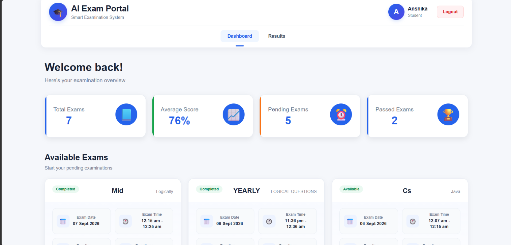
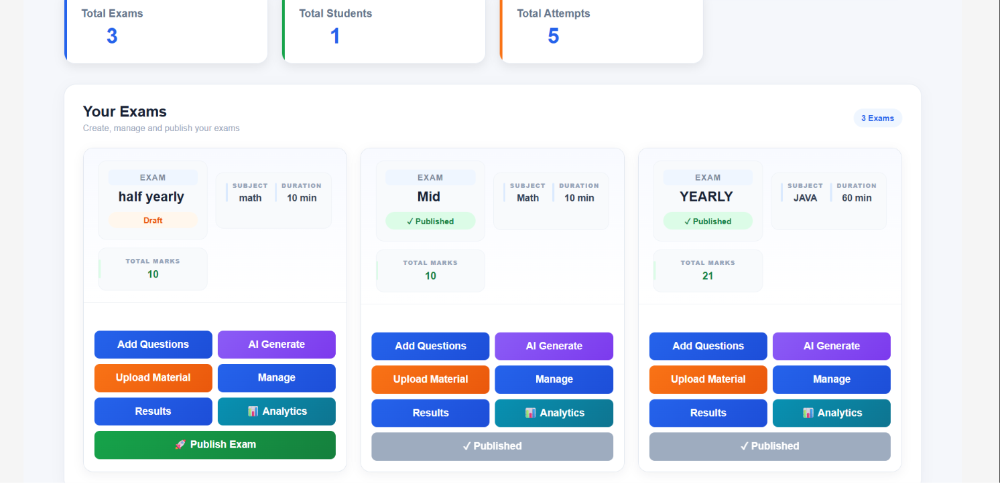
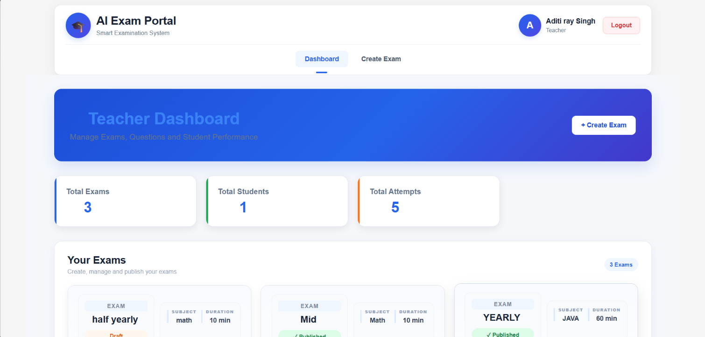
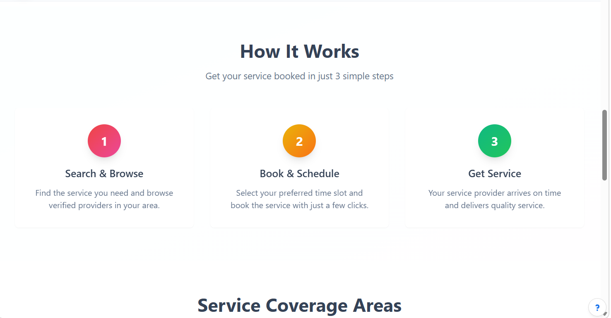
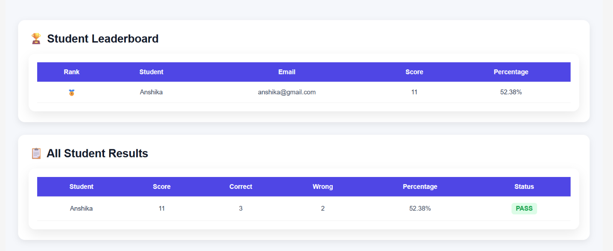

# 🧠 AI-Based Secure Examination System

<p align="center">
  <b>🚀 AI-powered online examination platform for creating, conducting, evaluating, and analyzing exams.</b>
</p>

<p align="center">


</p>

---

## ✨ Overview

**AI-Based Secure Examination System** is a full-stack online examination platform built with **React, Node.js, Express.js, MongoDB, JWT, and Google Gemini API**.

The system provides separate functionality for **Admin, Teacher, and Student** users. Teachers can create exams, manage questions, generate questions using AI, and analyze student performance. Students can attempt exams, view results, check rankings, and download or print their results.

---

## 🚀 Features

* 🤖 **AI Question Generation** — Generate questions using Google Gemini API.
* 📚 **Material-Based Questions** — Generate questions from uploaded study materials.
* 📝 **Multiple Question Types** — MCQ, True/False, Short Answer & Detailed Answer.
* 👥 **Role-Based Access** — Admin, Teacher & Student roles.
* 🔐 **JWT Authentication** — Secure login and protected APIs.
* 📊 **Result Analytics** — Bar graphs and performance analysis.
* 🏆 **Leaderboard** — High-score ranking and score tracking.
* 📥 **Result Download** — Download examination results.
* 🖨️ **Result Printing** — Print examination results.
* 👨‍🏫 **Exam Management** — Create exams and manage questions.
* 👨‍🎓 **Student Dashboard** — Attempt exams and track performance.

---

## 🛠️ Tech Stack

| Category          | Technologies                    |
| ----------------- | ------------------------------- |
| 🎨 Frontend       | React, CSS, Axios, React Router |
| ⚙️ Backend        | Node.js, Express.js, REST APIs  |
| 🗄️ Database      | MongoDB, Mongoose               |
| 🔐 Authentication | JWT                             |
| 🤖 AI             | Google Gemini API               |
| 🧪 Testing        | Postman                         |
| 🛠️ Tools         | VS Code, Git, GitHub            |

---

## 🔄 Application Flow

### 👨‍🏫 Teacher

```text
Login
  ↓
Teacher Dashboard
  ↓
Create Exam
  ↓
Add Questions / Generate with AI 🤖
  ↓
Publish Exam
  ↓
View Student Results
  ↓
Analyze Performance 📊
```

### 👨‍🎓 Student

```text
Register / Login
       ↓
Student Dashboard
       ↓
View Exams
       ↓
Attempt Exam
       ↓
Submit Exam
       ↓
View Result 📊
       ↓
Download / Print
       ↓
Check Ranking 🏆
```

---

## 🤖 AI Question Generation

Google Gemini API is integrated to help teachers generate questions from uploaded study materials.

```text
📚 Study Material
       ↓
📤 Upload
       ↓
🤖 Google Gemini API
       ↓
🧠 Generate Questions
       ↓
📝 Review Questions
       ↓
📋 Add to Exam
```

---

## 📊 Result Analytics

The system provides an interactive result dashboard with:

* 📈 Bar graph visualization
* ⭐ Score analysis
* 🏆 High-score ranking
* 📋 Detailed results
* 📥 Download results
* 🖨️ Print results

---

# 📸 Screenshots

## 👨‍🎓 Student Dashboard

<p align="center">
  
</p>

## 📝 Available Exams

<p align="center">
  
</p>

## 👨‍🏫 Teacher Dashboard

<p align="center">
  
</p>

## 📊 Teacher Analytics

<p align="center">
  
</p>

## 📈 Teacher Dashboard

<p align="center">
  
</p>

## 📋 Examination Result

<p align="center">
  
</p>

## 🏆 Leaderboard

<p align="center">
  
</p>

---

## 🏗️ Project Structure

```text
AI-Exam-Portal/
│
├── 📁 client/
│   ├── 📁 src/
│   │   ├── 📁 components/
│   │   ├── 📁 pages/
│   │   ├── 📁 styles/
│   │   └── 📁 services/
│   └── package.json
│
├── 📁 server/
│   ├── 📁 controllers/
│   ├── 📁 models/
│   ├── 📁 routes/
│   ├── 📁 middleware/
│   └── server.js
│
├── 📁 Screenshots/
│   ├── Exams.png
│   ├── leaderboard.png
│   ├── result.png
│   ├── student-dashboard.png
│   ├── teacher analyzing.png
│   ├── teacher dashboard.png
│   └── teacherDashboard.png
│
└── README.md
```

---

## ⚙️ Installation

### 1. Clone the Repository

```bash
git clone https://github.com/AditiRaySingh/AI-Exam-Portal.git
cd AI-Exam-Portal
```

### 2. Install Frontend

```bash
cd client
npm install
npm run dev
```

### 3. Install Backend

Open another terminal:

```bash
cd server
npm install
npm run dev
```

### 4. Environment Variables

Create `.env` inside the `server` folder:

```env
PORT=3000
MONGO_URI=your_mongodb_connection_string
JWT_SECRET=your_jwt_secret
GEMINI_API_KEY=your_gemini_api_key
```

---

## 🔗 Main API Modules

* 🔐 Authentication
* 📝 Exam Management
* ❓ Question Management
* 🤖 AI Question Generation
* 📚 Study Material Processing
* 📊 Result Management
* 📈 Performance Analytics

---

## 💡 Project Highlights

> 🤖 AI-powered question generation
> 📝 Four different question formats
> 🔐 JWT authentication & role-based authorization
> 📊 Interactive result analytics
> 🏆 High-score leaderboard
> 📥 Download & print results
> ⚛️ Full-stack React + Node.js application

---

## 👩‍💻 Author

**Aditi Ray Singh**

💻 Full-Stack Developer
⚛️ React | Node.js | Express.js | MongoDB | JavaScript

---

<p align="center">
  ⭐ <b>If you like this project, consider giving it a star!</b>
</p>
