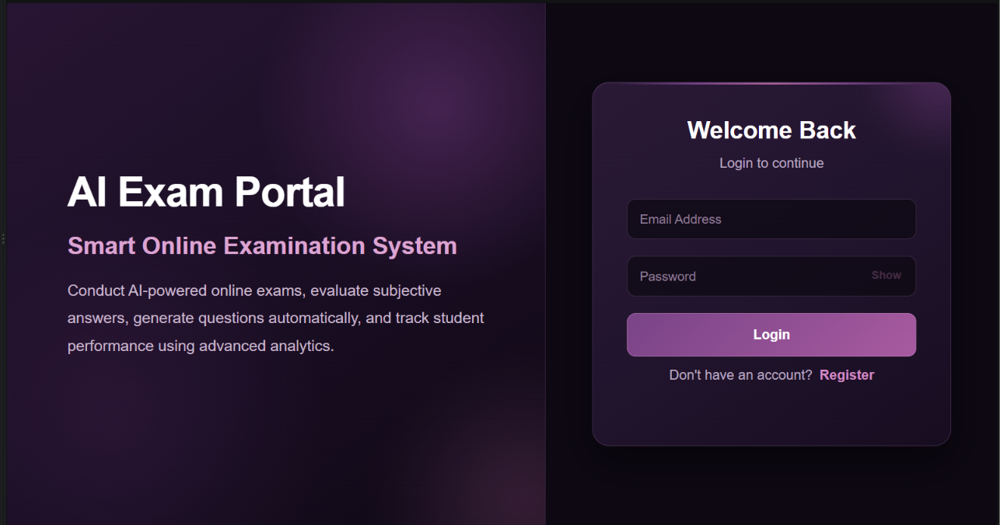
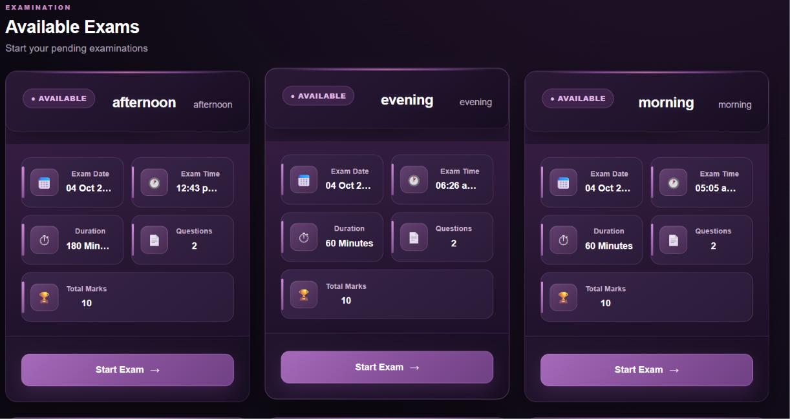
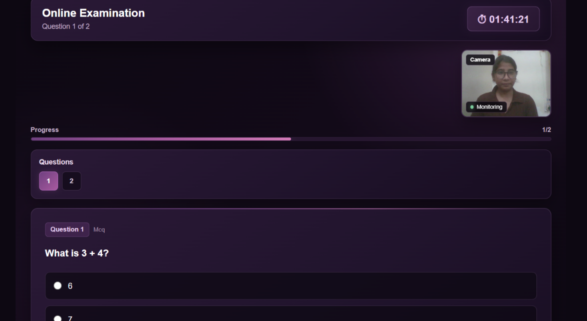
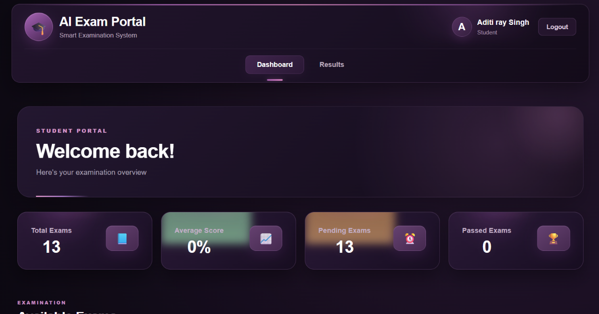
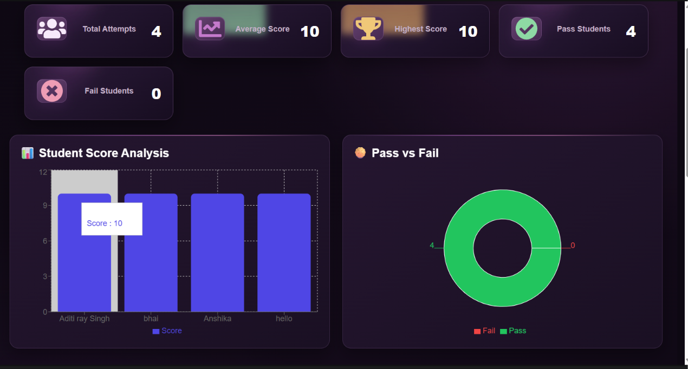
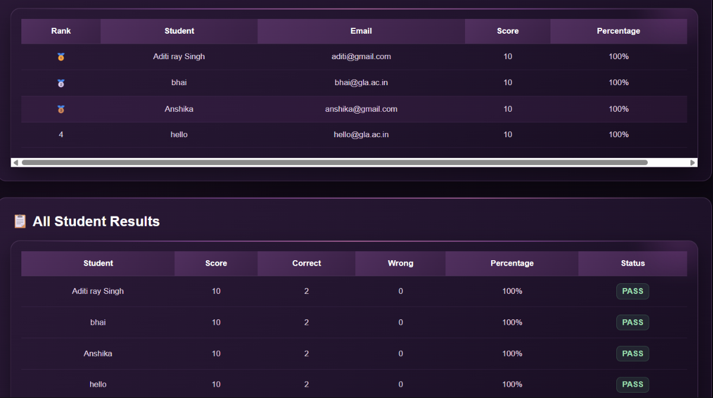
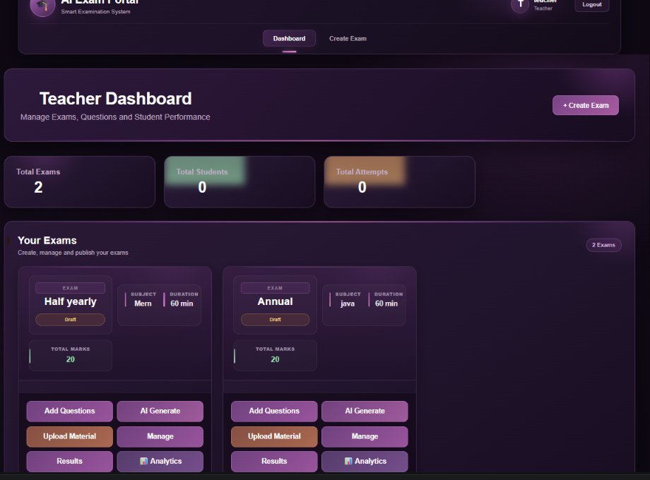
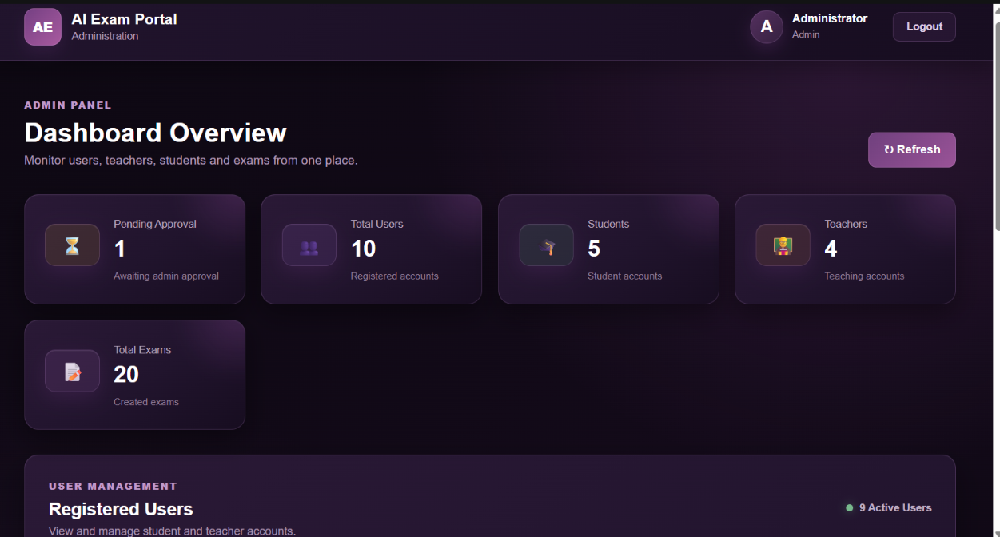
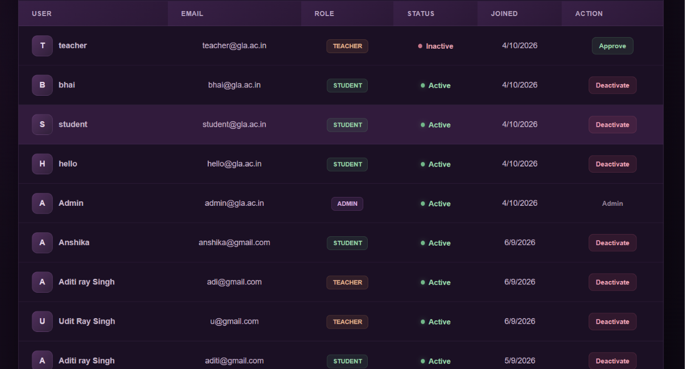
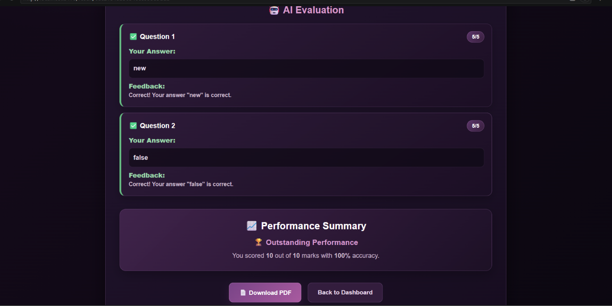

# 🧠 AI Exam Portal

<p align="center">

## 🚀 AI-Powered Full-Stack Online Examination Platform

A modern examination platform built with the **MERN Stack**, combining
online assessments, AI-assisted question generation, answer evaluation,
role-based access control, and performance analytics.

<br>


</p>
---

# 📌 Project Overview

**AI Exam Portal** is a full-stack online examination system designed for:

| 🎓 Student | 👨‍🏫 Teacher | 🛡️ Admin |
|---|---|---|
| View Published Exams | Create Examinations | Manage Users |
| Attempt Exams | Manage Questions | Manage Students |
| Submit Answers | Generate Questions with AI | Manage Teachers |
| View Results | Review Questions | Platform Dashboard |
| View Performance | Publish Examinations | Platform Statistics |
| View Attempt History | View Student Results | Administrative Operations |

The platform manages the complete examination lifecycle:

```text
📝 Create Examination
        ↓
📚 Add Questions
        ↓
🤖 Generate Questions with AI
        ↓
🔍 Teacher Review
        ↓
🚀 Publish Examination
        ↓
🎓 Student Attempts Exam
        ↓
📤 Submit Answers
        ↓
🧠 Evaluate Answers
        ↓
📊 Generate Result
        ↓
📈 Performance Analytics
```

---

# 🎯 Main Objectives

| Objective | Description |
|---|---|
| 📝 Online Examination | Provide an interactive examination experience |
| 📚 Question Management | Simplify question creation and management |
| 🤖 AI Assistance | Reduce teacher effort using AI |
| 📄 Material-Based Generation | Generate questions from study material |
| 🧠 Answer Evaluation | Assist with answer evaluation |
| 📊 Result Management | Generate detailed examination results |
| 📈 Analytics | Provide student and teacher performance analytics |
| 🔐 Security | Implement authentication and role-based authorization |
| 🚫 Attempt Protection | Prevent duplicate examination attempts |

---

# ✨ Core Features

## 👥 Role-Based Features

| 🎓 Student | 👨‍🏫 Teacher | 🛡️ Admin |
|---|---|---|
| 🔐 Secure Registration & Login | 📝 Create Examinations | 👥 User Management |
| 📚 View Published Exams | 📚 Question Management | 🎓 Student Management |
| ▶️ Attempt Exams | 🤖 AI Question Generation | 👨‍🏫 Teacher Management |
| ⏱️ Exam Timer | 📄 Material-Based Generation | 📊 Platform Dashboard |
| 🧭 Question Navigation | 🔍 Question Review | 📈 Platform Statistics |
| 📤 Answer Submission | 🚀 Exam Publishing | ⚙️ Administrative Operations |
| 📊 View Results | 📊 Student Results | 🔐 Access Control |
| 🏆 View Performance | 📈 Performance Analytics | 🛡️ Platform Security |
| 🔄 View Attempt History | 👥 Attempt Statistics | |

---

# 🤖 AI Capabilities

AI is integrated into the actual examination workflow to assist teachers.

## 🧠 AI Question Generation

```text
📄 Study Material
       │
       ▼
🤖 AI Processing
       │
       ▼
📝 Generated Questions
       │
       ▼
🔍 Teacher Review
       │
       ▼
🚀 Published Examination
```

## 🤖 AI Features

| AI Feature | Purpose |
|---|---|
| 🧠 AI Question Generation | Generate examination questions |
| 📄 Material-Based Generation | Generate questions from uploaded study material |
| ✍️ AI Answer Evaluation | Assist with answer evaluation |
| 🔍 Teacher Review | Review and modify generated questions |
| ⚡ Faster Preparation | Reduce manual question creation |

> 💡 **Teacher Control:** AI-generated questions are reviewed by the teacher
> before they become part of the published examination.

---

# 🔄 Examination Workflow

## 👨‍🏫 Teacher Workflow

| Step | Action |
|:---:|---|
| 01 | 📝 Create Examination |
| 02 | 📚 Add Questions |
| 03 | 🤖 Generate Questions with AI |
| 04 | 🔍 Review Questions |
| 05 | 🚀 Publish Examination |
| 06 | 📊 Monitor Student Results |

## 🎓 Student Workflow

| Step | Action |
|:---:|---|
| 01 | 📚 View Published Examination |
| 02 | ▶️ Start Examination |
| 03 | ✍️ Answer Questions |
| 04 | ⏱️ Complete Within Time |
| 05 | 📤 Submit Examination |
| 06 | 📊 View Result |
| 07 | 📈 View Performance |

## ⚙️ System Workflow

| Step | Action |
|:---:|---|
| 01 | 📥 Receive Submitted Answers |
| 02 | 🧠 Evaluate Answers |
| 03 | 📊 Calculate Score |
| 04 | 🏆 Generate Result |
| 05 | 📈 Update Performance Data |

---

# 🏗️ System Architecture

The application follows a simple full-stack architecture:

```text
                    👥 USERS
          Student • Teacher • Admin
                       │
                       ▼
              🎨 REACT FRONTEND
             UI • Pages • Routing
                       │
                       ▼
                 🔗 REST API
                    Axios
                       │
                       ▼
             ⚙️ NODE.JS + EXPRESS
                       │
        ┌──────────────┼──────────────┐
        │              │              │
        ▼              ▼              ▼
   🔐 AUTH         📝 EXAMS       📚 QUESTIONS
   JWT + RBAC      Management      Management
        │              │              │
        └──────────────┼──────────────┘
                       │
              ┌────────┴────────┐
              │                 │
              ▼                 ▼
       📊 RESULTS         📈 ANALYTICS
       Score & Status     Performance Data
              │                 │
              └────────┬────────┘
                       │
                       ▼
                 🍃 MONGODB
       Users • Exams • Questions
       Attempts • Results
                       │
                       │
                       ▼
                 🤖 AI SERVICES
                       │
              ┌────────┴────────┐
              │                 │
              ▼                 ▼
       🧠 Question          ✍️ Answer
        Generation          Evaluation
```

## 🔗 Architecture Components

| Layer | Responsibility |
|---|---|
| 🎨 React Frontend | User interface and application pages |
| 🔗 Axios / REST API | Communication between frontend and backend |
| ⚙️ Node.js + Express | Backend application and API handling |
| 🔐 Authentication | JWT-based login and protected requests |
| 🛡️ Authorization | Role-based access for Student, Teacher and Admin |
| 📝 Exam Management | Create, update, publish and manage examinations |
| 📚 Question Management | Create, update and review questions |
| 📊 Attempts & Results | Store submissions, scores and results |
| 📈 Analytics | Student and teacher performance statistics |
| 🤖 AI Services | Question generation and answer evaluation |
| 🍃 MongoDB | Persistent application data storage |

---

# 🧩 Technology Stack

| Layer | Technologies |
|---|---|
| 🎨 **Frontend** | React, JavaScript, CSS |
| 🔀 **Routing** | React Router |
| 🌐 **API Communication** | Axios |
| ⚙️ **Backend** | Node.js, Express.js |
| 🍃 **Database** | MongoDB, Mongoose |
| 🔐 **Authentication** | JWT |
| 🛡️ **Authorization** | Role-Based Access Control |
| 🤖 **AI** | AI Question Generation, Material Generation, Answer Evaluation |
| 📊 **Visualization** | Recharts |
| 📄 **PDF** | jsPDF, html2canvas |

---

# 📸 Application Screenshots

> 🎨 Screenshots are displayed individually at a consistent width for
> better readability and a cleaner GitHub README.

---

## 🔐 Authentication

<table>
<tr>
<td align="center">

### 🔑 Secure Login



</td>
</tr>
</table>

---

## 📚 Available Examinations

<table>
<tr>
<td align="center">

### 📚 Published & Available Exams



</td>
</tr>
</table>

---

## 📝 Online Examination

<table>
<tr>
<td align="center">

### ⏱️ Interactive Online Examination



</td>
</tr>
</table>

---

## 🎓 Student Dashboard

<table>
<tr>
<td align="center">

### 🎓 Student Dashboard & Exam Overview



</td>
</tr>
</table>

---

## 📊 Examination Results

<table>
<tr>
<td align="center">

### 📊 Detailed Examination Results



</td>
</tr>
</table>

---

## 🏆 Ranking & Performance

<table>
<tr>
<td align="center">

### 🏆 Student Ranking & Performance



</td>
</tr>
</table>

---

## 👨‍🏫 Teacher Dashboard

<table>
<tr>
<td align="center">

### 👨‍🏫 Teacher Dashboard & Examination Management



</td>
</tr>
</table>

---

## 🛡️ Admin Dashboard

<table>
<tr>
<td align="center">

### 🛡️ Administrative Dashboard



</td>
</tr>
</table>

---

## ✅ Admin Approval

<table>
<tr>
<td align="center">

### ✅ Admin Approval Management



</td>
</tr>
</table>

---

## 🤖 AI-Assisted Answer Evaluation

<table>
<tr>
<td align="center">

### 🤖 AI Answer Evaluation



</td>
</tr>
</table>

---

# 📁 Project Structure

```text
AI-Exam-Portal/
│
├── frontend/
│   │
│   ├── public/
│   │
│   └── src/
│       │
│       ├── components/
│       │
│       ├── pages/
│       │
│       ├── styles/
│       │
│       ├── services/
│       │
│       ├── assets/
│       │
│       └── App.jsx
│
├── backend/
│   │
│   ├── config/
│   │
│   ├── controllers/
│   │
│   ├── middleware/
│   │
│   ├── models/
│   │
│   ├── routes/
│   │
│   └── server.js
│
├── Screenshots/
│   ├── Login.png
│   ├── Available_exam.png
│   ├── exam.png
│   ├── student_dashboard.png
│   ├── results.png
│   ├── ranking.png
│   ├── teacher_dashboard.png
│   ├── admin_dashboard.png
│   ├── admin_approval.png
│   └── ai_evaluation.png
│
├── .gitignore
├── README.md
└── package.json
```

---

# 🔐 Security & Authentication

The application uses **JWT-based authentication** and
**role-based authorization**.

## 🔄 Authentication Flow

```text
👤 User
   │
   ▼
🔐 Register / Login
   │
   ▼
🎟️ JWT Token
   │
   ▼
🛡️ Protected API Request
   │
   ▼
👮 Role Authorization
   │
   ▼
✅ Requested Resource
```

## 🛡️ Security Features

| Security Feature | Implementation |
|---|---|
| 🔐 Authentication | JWT |
| 🛡️ Protected Routes | Authentication Middleware |
| 👥 Authorization | Role-Based Access Control |
| 🚫 Duplicate Attempts | Attempt Validation |
| ⏱️ Exam Timing | Start / End Time Validation |
| 🙈 Correct Answers | Hidden During Examination |
| 📤 Answer Submission | Protected API |
| 🔒 Route Separation | Student / Teacher / Admin |

---

# 📡 API Modules

| Endpoint | Purpose |
|---|---|
| 🔐 `/api/auth` | Authentication & Registration |
| 📝 `/api/exams` | Examination Management |
| 📚 `/api/questions` | Question Management |
| ▶️ `/api/exam-attempts` | Exam Attempts & Submission |
| 📊 `/api/dashboard` | Dashboard Data |
| 📄 `/api/ai/material` | Material-Based AI Generation |
| 🤖 `/api/ai/question` | AI Question Generation |
| 🧠 `/api/ai/evaluation` | AI Answer Evaluation |
| 🏆 `/api/results` | Student Results |
| 🛡️ `/api/admin` | Administrative Operations |

---

# 📊 Examination Evaluation

The examination system records multiple performance metrics.

| Metric | Description |
|---|---|
| 🏆 **Score** | Marks obtained by the student |
| 📊 **Percentage** | Overall examination percentage |
| ✅ **Correct** | Number of correct answers |
| ❌ **Wrong** | Number of incorrect answers |
| ⏭️ **Skipped** | Number of unanswered questions |
| 🎯 **Result** | Pass or Fail |
| ⏱️ **Time Taken** | Time spent during examination |
| 🔄 **Attempt Status** | Current examination state |

---

# 📈 Analytics

## 👨‍🏫 Teacher Analytics

Teachers can monitor examination and student performance.

| Analytics | Description |
|---|---|
| 📊 Average Score | Average marks obtained |
| 🏆 Highest Score | Highest examination score |
| 👥 Total Attempts | Number of examination attempts |
| ✅ Pass Count | Number of students who passed |
| ❌ Fail Count | Number of students who failed |
| 🥇 Leaderboard | Student ranking |
| 📈 Performance | Student performance statistics |

## 🎓 Student Performance

Students can view:

| Performance Data |
|---|
| 🏆 Score |
| 📊 Percentage |
| ✅ Correct Answers |
| ❌ Wrong Answers |
| ⏭️ Skipped Answers |
| 🎯 Result Status |
| ⏱️ Time Taken |
| 🔄 Previous Examination Attempts |

---

# 🚀 Installation & Setup

## 1️⃣ Clone Repository

```bash
git clone https://github.com/AditiRaySingh/AI-Exam-Portal.git
cd AI-Exam-Portal
```

---

## 2️⃣ Backend Setup

```bash
cd backend
npm install
npm start
```

---

## 3️⃣ Frontend Setup

Open another terminal:

```bash
cd frontend
npm install
npm run dev
```

---

# 🔑 Environment Variables

Create a `.env` file inside the `backend` directory.

```env
PORT=3000
MONGO_URI=your_mongodb_connection_string
JWT_SECRET=your_jwt_secret
GROQ_API_KEY=your_ai_api_key
```

> ⚠️ **Security Warning**
>
> Never commit `.env` files, database credentials, JWT secrets,
> or AI API keys to GitHub.

---

# 🌐 Local Development

| Service | URL |
|---|---|
| 🎨 Frontend | `http://localhost:5173` |
| ⚙️ Backend | `http://localhost:3000` |

---

# 💡 Engineering Highlights

| Area | Implementation |
|---|---|
| 🎨 Frontend | React-based responsive interface |
| ⚙️ Backend | Node.js + Express REST APIs |
| 🍃 Database | MongoDB with Mongoose |
| 🔐 Authentication | JWT |
| 🛡️ Authorization | Role-Based Access Control |
| 📝 Examination | Complete examination lifecycle |
| 🤖 AI | Question generation & answer evaluation |
| 📚 Questions | Manual & AI-assisted |
| 📊 Evaluation | Score, percentage, correct, wrong, skipped |
| 📈 Analytics | Student & teacher performance |
| 🔒 Security | Protected routes & attempt control |
| 🌙 UI | Responsive dark-themed interface |

---

# 🗺️ Future Improvements

| Planned Feature | Status |
|---|:---:|
| 📧 Email Notifications | 🔵 Planned |
| ⚡ Real-Time Notifications | 🔵 Planned |
| 📊 Advanced Analytics | 🔵 Planned |
| 🧠 Enhanced AI Evaluation | 🔵 Planned |
| 🏆 Advanced Leaderboard | 🔵 Planned |
| 📱 Progressive Web App | 🔵 Planned |
| ☁️ Improved Cloud Deployment | 🔵 Planned |
| 🔐 Additional Exam Security | 🔵 Planned |

---

# 👩‍💻 Author

<p align="center">

## Aditi Singh

### Full-Stack Developer · MERN Stack · AI Integration

<a href="https://github.com/AditiRaySingh">

</a>

</p>

---

# ⭐ Support

If you find this project interesting:

⭐ **Star** the repository  
🍴 **Fork** the project  
💡 **Share** your feedback

---

<p align="center">

# 🧠 AI Exam Portal

### 🤖 AI-Assisted Examination  
### 🔐 Secure Access  
### 📊 Performance Analytics

<br>

**Built with ❤️ using the MERN Stack**

</p>
