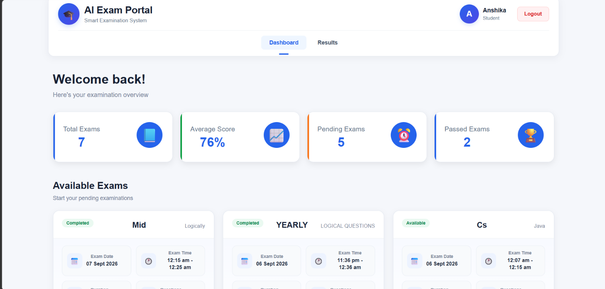
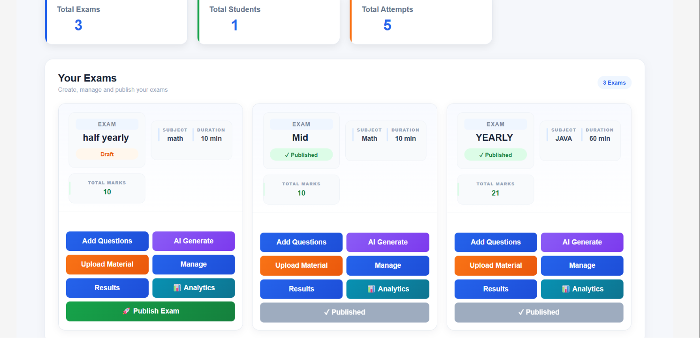
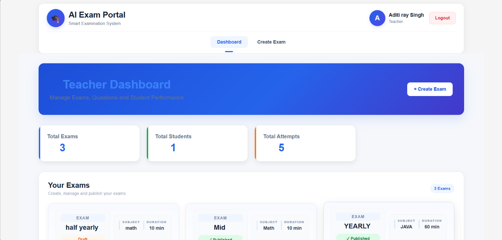
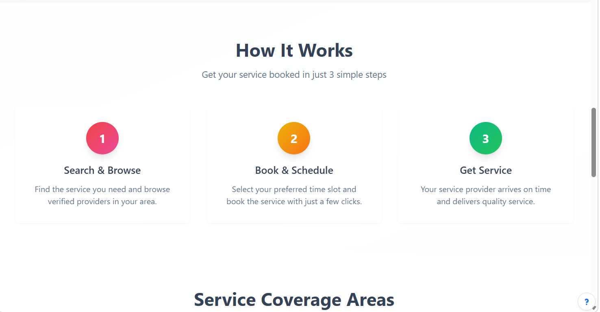
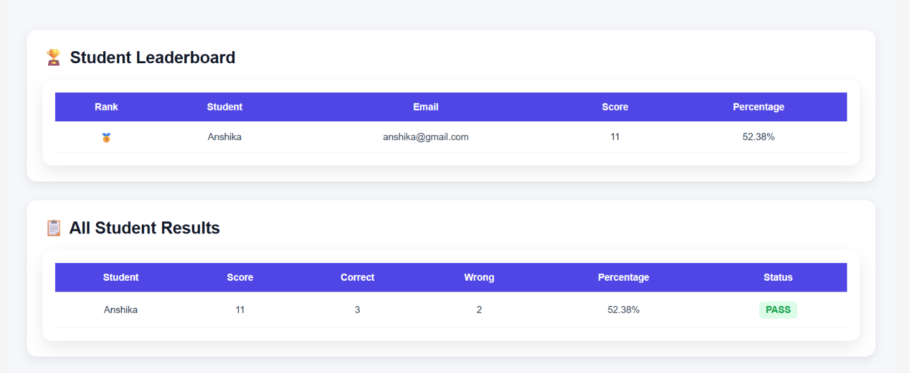

# 🧠✨ AI EXAM PORTAL

### 🚀 Smart • Secure • AI-Powered • Full-Stack Examination Platform

  
  
  
  

  
  
  
  

 

### 🎯 A modern online examination platform built with MERN Stack + AI

  <b>Create Exams</b> •
  <b>Generate Questions with AI</b> •
  <b>Conduct Exams</b> •
  <b>Evaluate Results</b> •
  <b>Analyze Performance</b>

 

<a href="#-overview">📖 Overview</a> •
<a href="#-features">✨ Features</a> •
<a href="#-ai-capabilities">🤖 AI</a> •
<a href="#-architecture">🏗️ Architecture</a> •
<a href="#-screenshots">📸 Screenshots</a> •
<a href="#-installation">🚀 Installation</a>

---

# 🌟 OVERVIEW

**AI Exam Portal** is a full-stack web-based examination platform designed to make online assessments more **efficient, secure, intelligent and user-friendly**.

The system provides separate experiences for:

| 🎓 Student | 👨‍🏫 Teacher | 🛡️ Admin |
|:---:|:---:|:---:|
| Take Exams | Create Exams | Manage Platform |
| View Results | Manage Questions | Manage Users |
| Track History | AI Question Generation | Monitor System |
| Analyze Performance | Publish Exams | Platform Control |

The platform combines:

> 🧠 **AI Assistance** + 📝 **Online Examinations** + 📊 **Analytics** + 🔐 **Secure Authentication**

into one complete application.

---

# 💜 WHY AI EXAM PORTAL?

Traditional examination systems often require teachers to manually create questions, manage exams, evaluate answers and analyze results.

This platform brings these processes together in one place.

                    🧠 AI EXAM PORTAL
                           │
        ┌──────────────────┼──────────────────┐
        │                  │                  │
        ▼                  ▼                  ▼
   🎓 STUDENT          👨‍🏫 TEACHER        🛡️ ADMIN
        │                  │                  │
        ▼                  ▼                  ▼
   Take Exams         Create Exams        Manage Users
   Submit Answers     Add Questions       Monitor System
   View Results       AI Generation       Platform Control
   View History       Analytics
✨ FEATURES
🎓 Student Features
Feature	Description
🔐 Authentication	Secure login and registration
📚 Exam Dashboard	View available examinations
📝 Online Examination	Attempt questions through an interactive interface
⏱️ Timer	Track remaining examination time
🧭 Question Navigation	Navigate between questions
📤 Exam Submission	Submit answers securely
🏆 Results	View score and examination result
📊 Performance	Track examination history
🔒 Attempt Protection	Prevent duplicate examination attempts
👨‍🏫 Teacher Features
Feature	Description
📝 Create Exam	Create new examinations
❓ Add Questions	Add questions manually
🤖 AI Questions	Generate questions using AI
📚 Material Upload	Generate questions from study material
✏️ Edit Questions	Review and modify questions
🚀 Publish Exam	Publish examinations for students
📊 Results	View student results
📈 Analytics	Analyze student performance
👥 Student Statistics	Track students and attempts
🛡️ Admin Features
Feature	Description
👥 User Management	Manage platform users
🎓 Student Management	Monitor students
👨‍🏫 Teacher Management	Monitor teachers
📊 Dashboard	View platform statistics
⚙️ Platform Management	Manage examination system
🤖 AI CAPABILITIES

One of the major features of the platform is AI-assisted examination creation and evaluation.

🧠 AI Question Generation

Teachers can use AI to reduce the time required to create examination questions.

             📚 STUDY MATERIAL
                    │
                    ▼
             🤖 AI PROCESSING
                    │
                    ▼
          🧠 QUESTION GENERATION
                    │
                    ▼
              ✏️ REVIEW
                    │
                    ▼
             📝 CREATE EXAM
                    │
                    ▼
              🚀 PUBLISH
AI Features
🤖 AI-assisted question generation
📚 Question generation from study material
🧠 AI-assisted answer evaluation
✏️ Teacher review before using generated questions
⚡ Faster examination preparation

💡 AI is designed to assist teachers rather than completely replace manual review.

🔄 COMPLETE EXAMINATION FLOW
                    👨‍🏫 TEACHER
                         │
                         ▼
                  📝 CREATE EXAM
                         │
              ┌──────────┴──────────┐
              │                     │
              ▼                     ▼
       ✍️ Manual Questions     🤖 AI Questions
              │                     │
              └──────────┬──────────┘
                         ▼
                   ✏️ REVIEW
                         │
                         ▼
                    🚀 PUBLISH
                         │
                         ▼
                    🎓 STUDENT
                         │
                         ▼
                   📝 START EXAM
                         │
                         ▼
                  ⏱️ ANSWER QUESTIONS
                         │
                         ▼
                     📤 SUBMIT
                         │
                         ▼
                  🧠 EVALUATION
                         │
                         ▼
                    🏆 RESULT
                         │
                         ▼
                    📊 ANALYTICS
🏗️ ARCHITECTURE
                         🌐 USER
                           │
                           ▼
                  ⚛️ REACT FRONTEND
                           │
                           ▼
                     🔐 JWT AUTH
                           │
                           ▼
                    🚀 REST APIs
                           │
              ┌────────────┼────────────┐
              │            │            │
              ▼            ▼            ▼
          👨‍🎓 Student   👨‍🏫 Teacher   🛡️ Admin
              │            │            │
              └────────────┼────────────┘
                           │
                           ▼
                     🟢 NODE.JS
                           │
                           ▼
                   ⚡ EXPRESS.JS
                           │
             ┌─────────────┼─────────────┐
             │             │             │
             ▼             ▼             ▼
        🍃 MongoDB       🤖 AI        📊 Results
🛠️ TECHNOLOGY STACK
🎨 Frontend

    

Frontend Technologies
⚛️ React
🟨 JavaScript
🎨 CSS
🌐 Axios
🧭 React Router
⚙️ Backend

   

Backend Technologies
🟢 Node.js
⚡ Express.js
🔐 JWT Authentication
🛡️ Middleware
📡 REST APIs
🗄️ Database

   

🤖 AI

   

AI is integrated into the examination workflow for:

🧠 Question generation
📚 Material-based question generation
📝 Answer evaluation
📊 DASHBOARD SYSTEM

The application provides different dashboards based on user roles.

🎓 Student Dashboard
┌─────────────────────────────────────┐
│          🎓 STUDENT DASHBOARD       │
├─────────────────────────────────────┤
│                                     │
│  📚 Available Exams                 │
│  📝 My Attempts                     │
│  🏆 Results                         │
│  📊 Performance                     │
│  📈 Examination History             │
│                                     │
└─────────────────────────────────────┘
👨‍🏫 Teacher Dashboard
┌─────────────────────────────────────┐
│          👨‍🏫 TEACHER DASHBOARD     │
├─────────────────────────────────────┤
│                                     │
│  📝 Total Exams                     │
│  👥 Total Students                  │
│  📊 Total Attempts                  │
│                                     │
│  ➕ Create Exam                     │
│  🤖 AI Generate                     │
│  📚 Upload Material                 │
│  📈 Analytics                       │
│                                     │
└─────────────────────────────────────┘
📸 SCREENSHOTS
🎓 Student Dashboard

  

📝 Examination Dashboard

  

👨‍🏫 Teacher Dashboard

  

📊 Teacher Analytics

  

🏆 Results

  

🏅 Leaderboard

  

📁 PROJECT STRUCTURE
AI-Exam-Portal/
│
├── 📂 frontend/
│   │
│   ├── 📂 public/
│   │
│   ├── 📂 src/
│   │   ├── 📂 components/
│   │   ├── 📂 pages/
│   │   ├── 📂 styles/
│   │   ├── 📂 services/
│   │   ├── 📂 assets/
│   │   └── App.jsx
│   │
│   ├── package.json
│   └── vite.config.js
│
├── 📂 backend/
│   │
│   ├── 📂 config/
│   ├── 📂 controllers/
│   ├── 📂 middleware/
│   ├── 📂 models/
│   ├── 📂 routes/
│   ├── 📂 services/
│   ├── 📂 utils/
│   ├── server.js
│   └── package.json
│
├── 📂 Screenshots/
│
├── 📄 .gitignore
├── 📄 README.md
└── 📄 package.json
🔐 SECURITY

The platform includes several mechanisms to improve examination security and access control.

🔑 Authentication
👤 User
  ↓
🔐 Login
  ↓
🎫 JWT Token
  ↓
🛡️ Protected Routes
  ↓
🎭 Role Authorization
🛡️ Access Control

Different actions are restricted according to the user's role.

🎓 STUDENT
   │
   ├── View Exams
   ├── Attempt Exams
   └── View Results

👨‍🏫 TEACHER
   │
   ├── Create Exams
   ├── Manage Questions
   ├── Publish Exams
   └── View Analytics

🛡️ ADMIN
   │
   └── Manage Platform
📡 API MODULES
🔗 Endpoint	📌 Purpose
/api/auth	🔐 Authentication & registration
/api/exams	📝 Exam management
/api/questions	❓ Question management
/api/exam-attempts	📤 Exam attempts & submission
/api/dashboard	📊 Dashboard information
/api/ai/material	📚 Material-based AI generation
/api/ai/question	🤖 AI question generation
/api/ai/evaluation	🧠 AI evaluation
/api/results	🏆 Result management
/api/admin	🛡️ Admin operations
🚀 INSTALLATION
1️⃣ Clone the Repository
git clone https://github.com/AditiRaySingh/AI-Exam-Portal.git
cd AI-Exam-Portal
2️⃣ Backend Setup
cd backend

Install dependencies:

npm install

Start the backend:

npm start
3️⃣ Frontend Setup

Open another terminal:

cd frontend

Install dependencies:

npm install

Start the frontend:

npm run dev
🔑 ENVIRONMENT VARIABLES

Create a .env file inside the backend directory.

PORT=3000

MONGO_URI=your_mongodb_connection_string

JWT_SECRET=your_jwt_secret

GROQ_API_KEY=your_ai_api_key

⚠️ Important: Never upload .env files or API keys to GitHub.

🌐 APPLICATION URL

After starting the project:

Frontend
http://localhost:5173

Backend
http://localhost:3000
🧪 TESTING FLOW

A typical examination workflow:

1️⃣ Register / Login
        ↓
2️⃣ Select Role
        ↓
3️⃣ Teacher Creates Exam
        ↓
4️⃣ Add Questions
        ↓
5️⃣ Publish Exam
        ↓
6️⃣ Student Starts Exam
        ↓
7️⃣ Student Answers Questions
        ↓
8️⃣ Submit Exam
        ↓
9️⃣ Automatic Evaluation
        ↓
🔟 Result Generated
        ↓
📊 Performance Analytics
📈 RESULT & EVALUATION

The system processes examination submissions and calculates performance information such as:

📊 Metric	Description
🎯 Score	Marks obtained
📈 Percentage	Overall performance
✅ Correct	Correct answers
❌ Wrong	Incorrect answers
⏭️ Skipped	Unanswered questions
🏆 Result	Pass / Fail
⏱️ Time Taken	Examination duration
💎 WHAT MAKES THIS PROJECT DIFFERENT?
🤖 AI + Examination

AI is not implemented as a separate demo. It is connected to the actual examination creation workflow.

👥 Multiple User Roles

The platform supports different workflows for:

Student → Teacher → Admin

📊 Complete Examination Lifecycle
Create
  ↓
Configure
  ↓
Add Questions
  ↓
Publish
  ↓
Attempt
  ↓
Submit
  ↓
Evaluate
  ↓
Analyze
🎨 Modern User Interface

The platform uses a modern dark UI with:

🟣 Purple gradients
💗 Pink/Lavender accents
✨ Glass-style visual elements
📱 Responsive layouts
🎯 Role-specific dashboards
🗺️ FUTURE ROADMAP
Status	Feature
🔄	Advanced Analytics
🔄	Real-Time Notifications
🔄	Email Notifications
🔄	Enhanced AI Evaluation
🔄	Advanced Leaderboard
🔄	Progressive Web App
🔄	Additional Exam Security
🔄	Cloud Infrastructure Improvements
📌 PROJECT HIGHLIGHTS
╔══════════════════════════════════════════════╗
║             🧠 AI EXAM PORTAL                ║
╠══════════════════════════════════════════════╣
║                                              ║
║  ⚛️  MERN Full-Stack Application             ║
║  🤖  AI-Assisted Question Generation         ║
║  🔐  JWT Authentication                      ║
║  👥  Role-Based Access Control               ║
║  📝  Complete Examination System             ║
║  📊  Performance Analytics                   ║
║  🏆  Result Management                       ║
║  🎨  Modern Responsive UI                    ║
║  🛡️  Attempt Protection                     ║
║                                              ║
╚══════════════════════════════════════════════╝
🎯 SKILLS DEMONSTRATED

This project demonstrates practical experience with:

Frontend Development
        ↓
React
        ↓
API Integration
        ↓
Node.js + Express
        ↓
MongoDB + Mongoose
        ↓
Authentication & Authorization
        ↓
AI API Integration
        ↓
Data Processing
        ↓
Result Evaluation
        ↓
Analytics
        ↓
Responsive UI Design
🏆 PROJECT STATUS

🟢 ACTIVE DEVELOPMENT
Category	Status
🎨 Frontend	✅ Completed
⚙️ Backend	✅ Completed
🗄️ Database	✅ Integrated
🔐 Authentication	✅ Implemented
📝 Examination System	✅ Implemented
🤖 AI Integration	✅ Implemented
📊 Analytics	✅ Implemented
📱 Responsive UI	✅ Implemented

👩‍💻 AUTHOR

💜 Aditi Singh
Full-Stack Developer | MERN Stack | AI Integration

    
 

⭐ SUPPORT THE PROJECT

If you find this project interesting:

⭐ Star the repository

🍴 Fork the project

💡 Share feedback

🚀 Explore the code

💜 BUILT WITH MERN + AI
🚀 From Examination Creation to Performance Analytics

Thank you for visiting the project!

 

⭐ ⭐ ⭐ ⭐ ⭐

 
