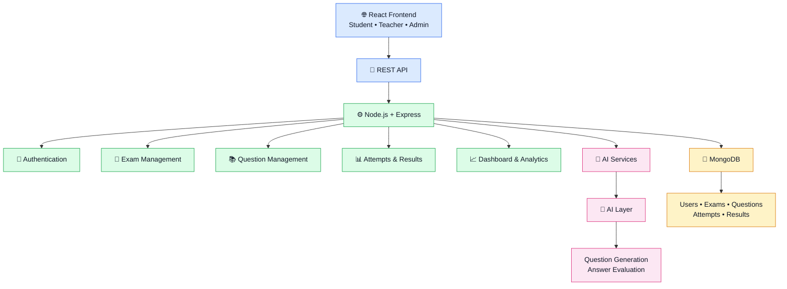

🧠 AI Exam Portal

AI-Powered Full-Stack Online Examination Platform
A modern examination platform built with the MERN stack, combining
online assessments, AI-assisted question generation, answer evaluation,
role-based access control, and performance analytics.

 
 
 
 
 
 

📌 Project Overview
AI Exam Portal is a full-stack online examination system designed for
Students, Teachers, and Administrators.
The platform manages the complete examination lifecycle:
Stage	Function
📝 01	Create Examination
📚 02	Add / Generate Questions
🤖 03	AI-Assisted Question Generation
🔍 04	Teacher Review
🚀 05	Publish Examination
🎓 06	Student Examination
🧠 07	Answer Evaluation
📊 08	Result Generation
📈 09	Performance Analytics

🎯 Main Objectives
- Provide an interactive online examination experience
- Simplify exam and question management
- Reduce teacher effort using AI
- Generate questions from study material
- Assist with answer evaluation
- Provide detailed examination results
- Provide student and teacher analytics
- Implement secure role-based access
- Prevent duplicate examination attempts
✨ Core Features
👥 Role-Based Features
🎓 Student	👨‍🏫 Teacher	🛡️ Admin
Secure Registration & Login	Create Examinations	User Management
View Published Exams	Question Management	Student Management
Attempt Exams	AI Question Generation	Teacher Management
Exam Timer	Material-Based Generation	Platform Dashboard
Question Navigation	Question Review	Platform Statistics
Answer Submission	Exam Publishing	Administrative Operations
View Results	Student Results	
View History	Performance Analytics	
Attempt Protection	Attempt Statistics	

🤖 AI Capabilities
AI is integrated into the actual examination workflow to assist teachers.
AI Question Generation
Study Material
      ↓
AI Processing
      ↓
Generated Questions
      ↓
Teacher Review
      ↓
Published Examination
AI Feature	Purpose
🤖 AI Question Generation	Generate examination questions
📄 Material-Based Generation	Generate questions from uploaded study material
🧠 AI Answer Evaluation	Assist with answer evaluation
🔍 Teacher Review	Review and modify generated questions
⚡ Faster Preparation	Reduce manual question creation
The teacher remains in control of the final question review and examination.
🔄 Examination Workflow
👨‍🏫 Teacher Workflow
Step	Action
1	📝 Create Exam
2	📚 Add Questions
3	🤖 Generate Questions with AI
4	🔍 Review Questions
5	🚀 Publish Exam
🎓 Student Workflow
Step	Action
1	📚 View Published Exam
2	▶️ Start Examination
3	✍️ Answer Questions
4	⏱️ Complete Within Time
5	📤 Submit Examination
6	📊 View Result
⚙️ System Workflow
Step	Action
1	🧠 Evaluate Answers
2	📊 Calculate Score
3	🏆 Generate Result
4	📈 Update Performance Data
📸 Application Screenshots
🎨 All screenshots are shown one-by-one at a comfortable size so each page is clearly visible on GitHub.

🔐 Authentication
<table align="center">
<tr><th>🔑 Secure Login</th></tr>
<tr><td align="center">

</td></tr>
</table>

📚 Available Examinations
<table align="center">
<tr><th>📚 Published & Available Exams</th></tr>
<tr><td align="center">

</td></tr>
</table>

📝 Online Examination
<table align="center">
<tr><th>⏱️ Interactive Online Examination</th></tr>
<tr><td align="center">

</td></tr>
</table>

🎓 Student Dashboard
<table align="center">
<tr><th>🎓 Student Dashboard & Exam Overview</th></tr>
<tr><td align="center">

</td></tr>
</table>

📊 Examination Results
<table align="center">
<tr><th>📊 Detailed Examination Results</th></tr>
<tr><td align="center">

</td></tr>
</table>

🏆 Ranking & Performance
<table align="center">
<tr><th>🏆 Student Ranking & Performance</th></tr>
<tr><td align="center">

</td></tr>
</table>

👨‍🏫 Teacher Dashboard
<table align="center">
<tr><th>👨‍🏫 Teacher Dashboard & Examination Management</th></tr>
<tr><td align="center">

</td></tr>
</table>

🛡️ Admin Dashboard
<table align="center">
<tr><th>🛡️ Administrative Dashboard</th></tr>
<tr><td align="center">

</td></tr>
</table>

✅ Admin Approval
<table align="center">
<tr><th>✅ Admin Approval Management</th></tr>
<tr><td align="center">

</td></tr>
</table>

🤖 AI-Assisted Answer Evaluation
<table align="center">
<tr><th>🤖 AI-Assisted Answer Evaluation</th></tr>
<tr><td align="center">

</td></tr>
</table>

🏗️ System Architecture

```mermaid
flowchart TB
    A["🌐 React Frontend<br/>Student • Teacher • Admin"] --> B["🔗 REST API"]
    B --> C["⚙️ Node.js + Express"]

    C --> D["🔐 Authentication"]
    C --> E["📝 Exam Management"]
    C --> F["📚 Question Management"]
    C --> G["📊 Attempts & Results"]
    C --> H["📈 Dashboard & Analytics"]
    C --> I["🤖 AI Services"]

    C --> J["🍃 MongoDB"]
    I --> K["🧠 AI Layer"]

    J --> J1["Users • Exams • Questions<br/>Attempts • Results"]
    K --> K1["Question Generation<br/>Answer Evaluation"]

    classDef frontend fill:#dbeafe,stroke:#2563eb,color:#111827;
    classDef backend fill:#dcfce7,stroke:#16a34a,color:#111827;
    classDef database fill:#fef3c7,stroke:#d97706,color:#111827;
    classDef ai fill:#fce7f3,stroke:#db2777,color:#111827;

    class A,B frontend;
    class C,D,E,F,G,H backend;
    class J,J1 database;
    class I,K,K1 ai;
```
🧩 Technology Stack
Layer	Technologies
| 🎨 Frontend | React, JavaScript, CSS |
| 🔀 Routing | React Router |
| 🌐 API Communication | Axios |
| ⚙️ Backend | Node.js, Express.js |
| 🗄️ Database | MongoDB, Mongoose |
| 🔐 Authentication | JWT |
| 🛡️ Authorization | Role-Based Access Control |
| 🤖 AI | AI Question Generation, Material Generation, Answer Evaluation |
| 📊 Visualization | Recharts |
| 📄 PDF | jsPDF, html2canvas |
📁 Project Structure
AI-Exam-Portal/
│
├── frontend/
│   │
│   ├── public/
│   │
│   └── src/
│       ├── components/
│       ├── pages/
│       ├── styles/
│       ├── services/
│       ├── assets/
│       └── App.jsx
│
├── backend/
│   │
│   ├── config/
│   ├── controllers/
│   ├── middleware/
│   ├── models/
│   ├── routes/
│   └── server.js
│
├── Screenshots/
│
├── .gitignore
├── README.md
│
└── package.json
🔐 Security & Authentication
The application uses JWT-based authentication and role-based authorization.
Authentication Flow
👤 User
  ↓
🔐 Register / Login
  ↓
🎟️ JWT Token
  ↓
🛡️ Protected API Request
  ↓
👮 Role Authorization
  ↓
✅ Requested Resource
Security Features
Security Feature	Implementation
| 🔐 Authentication | JWT |
🛡️ Protected Routes	Middleware
👥 Authorization	Role-Based Access
🚫 Duplicate Attempts	Attempt Validation
⏱️ Exam Timing	Start / End Time Validation
🙈 Correct Answers	Hidden During Examination
📤 Answer Submission	Protected API
🔒 Route Separation	Student / Teacher / Admin
📡 API Modules
Endpoint	Purpose
🔐 /api/auth	Authentication & Registration
📝 /api/exams	Examination Management
📚 /api/questions	Question Management
▶️ /api/exam-attempts	Exam Attempts & Submission
📊 /api/dashboard	Dashboard Data
📄 /api/ai/material	Material-Based AI Generation
🤖 /api/ai/question	AI Question Generation
🧠 /api/ai/evaluation	AI Answer Evaluation
🏆 /api/results	Student Results
🛡️ /api/admin	Administrative Operations
📊 Examination Evaluation
The examination system records multiple performance metrics.
Metric	Description
🏆 Score	Marks obtained by the student
📊 Percentage	Overall examination percentage
✅ Correct	Number of correct answers
❌ Wrong	Number of incorrect answers
⏭️ Skipped	Number of unanswered questions
🎯 Result	Pass or Fail
⏱️ Time Taken	Time spent during examination
🔄 Attempt Status	Current examination state
📈 Analytics
Teacher Analytics
Teachers can analyze:
📊 Average score
🏆 Highest score
👥 Total attempts
✅ Pass count
❌ Fail count
🥇 Student leaderboard
📈 Student performance
Student Performance
Students can view:
Score
Percentage
Correct answers
Wrong answers
Skipped answers
Result status
Time taken
Previous examination attempts
🚀 Installation & Setup
1. Clone Repository
   git clone https://github.com/AditiRaySingh/AI-Exam-Portal.git
cd AI-Exam-Portal
2. Backend Setup
cd backend
npm install
npm start
3. Frontend Setup
Open another terminal:
cd frontend
npm install
npm run dev
🔑 Environment Variables
Create a .env file inside the backend directory.
PORT=3000
MONGO_URI=your_mongodb_connection_string
JWT_SECRET=your_jwt_secret
GROQ_API_KEY=your_ai_api_key
⚠️ Never commit .env files, database credentials, JWT secrets, or AI API keys to GitHub.
🌐 Local Development
Service	URL
🎨 Frontend	http://localhost:5173
⚙️ Backend	http://localhost:3000
💡 Engineering Highlights
Area	Implementation
🎨 Frontend	React-based responsive interface
⚙️ Backend	Node.js + Express REST APIs
🍃 Database	MongoDB with Mongoose
| 🔐 Authentication | JWT |
| 🛡️ Authorization | Role-Based Access Control |
📝 Examination	Complete examination lifecycle
🤖 AI	Question generation & answer evaluation
📚 Questions	Manual & AI-assisted
📊 Evaluation	Score, percentage, correct, wrong, skipped
📈 Analytics	Student & teacher performance
🔒 Security	Protected routes & attempt control
🌙 UI	Responsive dark-themed interface
🗺️ Future Improvements
Planned Feature	Status
📧 Email Notifications	🔵 Planned
⚡ Real-Time Notifications	🔵 Planned
📊 Advanced Analytics	🔵 Planned
🧠 Enhanced AI Evaluation	🔵 Planned
🏆 Advanced Leaderboard	🔵 Planned
📱 Progressive Web App	🔵 Planned
☁️ Improved Cloud Deployment	🔵 Planned
🔐 Additional Exam Security	🔵 Planned
👩‍💻 Author

Aditi Singh

Full-Stack Developer · MERN Stack · AI Integration

  

⭐ Support
If you find this project interesting:
⭐ Star the repository · 🍴 Fork the project · 💡 Share feedback

🧠 AI Exam Portal

AI-Assisted Examination · Secure Access · Performance Analytics

Built with ❤️ using the MERN Stack

